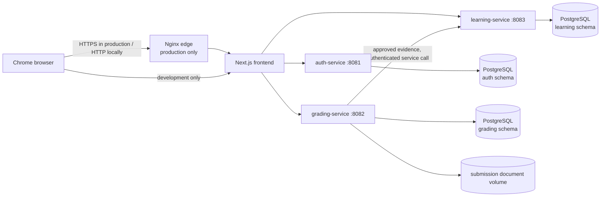
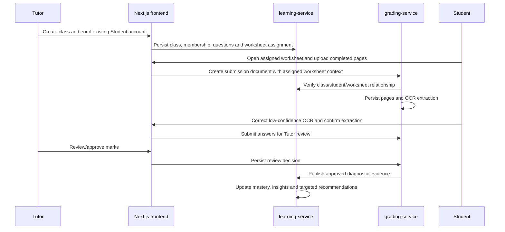

# Architecture

## Overview

Lumina is a browser application for Tutor and Student learning workflows.  The
frontend is a Next.js application; three Spring Boot services own their own
data and migrations in a shared PostgreSQL instance.  Docker Compose is the
local orchestration boundary.  The production overlay places Nginx at the
public edge; details, including the temporary VM TLS procedure, are in
[production transport](production-transport.md).

The three database nodes above are separate schemas in one PostgreSQL server,
not application-level shared tables.  Each service owns its Flyway history and
does not issue migrations for another service's schema.

## Service responsibilities

| Service | Owns | Public responsibility |
| --- | --- | --- |
| `auth-service` | `auth` schema | Account registration, login, BCrypt password verification, JWT issuance, and `TUTOR`/`STUDENT` roles. |
| `learning-service` | `learning` schema | Classes, memberships, student profiles, syllabus taxonomy, question bank, worksheets, assignments, mastery, insights, and reports. |
| `grading-service` | `grading` schema and document volume | Uploads, OCR extractions, answer-review state, AI marking proposals, Tutor approval, and durable hand-off of approved diagnostic evidence. |
| `frontend` | Browser state only | Role-aware Tutor and Student screens, API calls, form validation, route guards, and accessible UI. |

## Authorisation and data boundaries

1. The browser supplies the signed access token on protected API requests.
2. Each service verifies the token and enforces the role and resource owner.
3. Learning data uses stable auth user IDs for identity references.  It does
   not take database foreign keys to the `auth` schema.
4. Grading verifies a class/student/worksheet relationship with
   `learning-service` before accepting a submission.  A Tutor cannot make a
   cross-class submission by changing browser IDs.
5. The grading-to-learning approval hand-off uses the private
   `LEARNING_MARKING_SYNC_KEY`; that key is not published to the browser.

## End-to-end learning flow

## Deployment boundaries

Local development exposes the frontend, three APIs, PostgreSQL, and Adminer
for developer diagnostics through [compose.yaml](../compose.yaml).  The
production-shaped overlay exposes only Nginx on ports 80 and 443, keeps service
ports private, and reads secrets from the external `../secrets.txt` file.  See
the [deployment runbook](../README.md#deployment)
before using that overlay.

## Evidence

- Service topology and health checks: [compose.yaml](../compose.yaml).
- Auth workflow tests: [AuthControllerIntegrationTest.java](../backend/auth-service/src/test/java/com/fttranscendence/authservice/controller/AuthControllerIntegrationTest.java).
- Class and membership tests: [ClassStudentMembershipIntegrationTest.java](../backend/learning-service/src/test/java/com/fttranscendence/learning/classroom/ClassStudentMembershipIntegrationTest.java).
- Submission/OCR review tests: [OcrSubmissionFinalizationIntegrationTest.java](../backend/grading-service/src/test/java/com/fttranscendence/grading/controller/OcrSubmissionFinalizationIntegrationTest.java).
- Browser accessibility checks: [responsive-accessibility.spec.ts](../frontend/e2e/responsive-accessibility.spec.ts).
