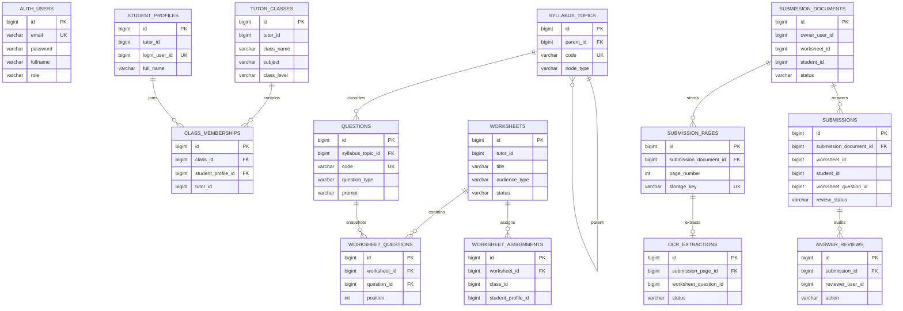

# Database schema

## Ownership

PostgreSQL is shared only as an operational server.  The application uses
three separate schemas—`auth`, `learning`, and `grading`—and each Spring Boot
service runs its own Flyway migrations.  The schema names and connection
configuration are defined in [compose.yaml](../compose.yaml).  The migration
files are the executable source of truth; this document is a navigational map,
not a second schema definition.

`AUTH_USERS` is intentionally shown separately: `learning` and `grading`
retain stable auth IDs but do not create cross-schema foreign keys.  This keeps
service ownership explicit while authentication remains centralised.

## Migration source of truth

| Schema | Initial and representative migrations | Verification |
| --- | --- | --- |
| `auth` | [V1 users](../backend/auth-service/src/main/resources/db/migration/V1__create_users.sql) | [migration integration test](../backend/auth-service/src/test/java/com/fttranscendence/authservice/database/MigrationIntegrationTest.java) |
| `learning` | [classes](../backend/learning-service/src/main/resources/db/migration/V2__create_classes.sql), [students](../backend/learning-service/src/main/resources/db/migration/V3__create_students.sql), [taxonomy](../backend/learning-service/src/main/resources/db/migration/V4__create_syllabus.sql), [questions](../backend/learning-service/src/main/resources/db/migration/V6__create_questions.sql), [worksheets](../backend/learning-service/src/main/resources/db/migration/V7__create_worksheets.sql) | [migration integration test](../backend/learning-service/src/test/java/com/fttranscendence/learning/database/MigrationIntegrationTest.java) |
| `grading` | [submission documents](../backend/grading-service/src/main/resources/db/migration/V2__create_submission_documents.sql), [answers/reviews](../backend/grading-service/src/main/resources/db/migration/V3__create_answers_and_reviews.sql), [OCR](../backend/grading-service/src/main/resources/db/migration/V5__create_ocr_extractions.sql) | [migration integration test](../backend/grading-service/src/test/java/com/fttranscendence/grading/database/MigrationIntegrationTest.java) |

## Integrity rules worth preserving

- A class membership is unique per student and class and is constrained to the
  same Tutor owner.
- Question records reference an existing syllabus topic or subtopic; worksheet
  questions preserve a deterministic position.
- An assignment is either class-targeted or student-targeted, never both.
- Each persisted page has a bounded, accepted media type and a SHA-256 checksum
  unique within its document.
- Student-answer reviews are append-only audit records associated with a
  persisted answer row.

For the full service-level ownership explanation, see
[service boundaries](architecture/service-boundaries.md).
